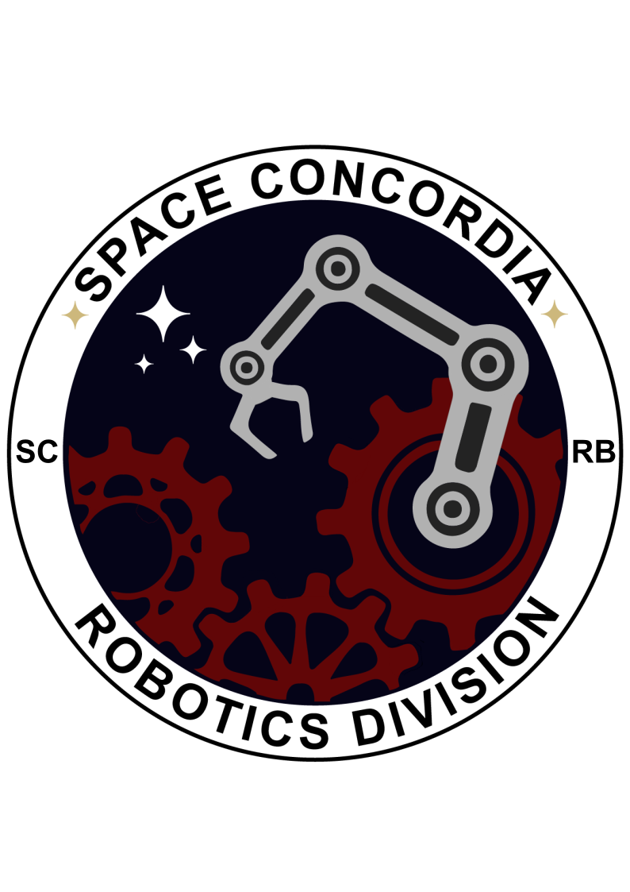

<p align="center">
    
</p>

# Intro task for Space Concordia Robotics Division
## SOFTWARE TEAM: SOFTWARE TRAINING

Ignore every file except introtask and intropytask

To run, type this code inside a terminal
```
cd ros2_ws
source install/setup.bash
ros2 run introtask talker
```
open another terminal and run
```
source install/setup.bash
ros2 run intropytask listener
```
and you should be good to go :)
